# SuperStore Sales Dashboard
 

# Table of Contents

1. [Introduction](#introduction)
2. [Dataset](#dataset)
3. [Data Cleaning](#data-cleaning)
4. [Pivot tables](#pivot-table-analysis)
    * [Total Sales Over Time](#total-sales-over-time)
    * [Total Sales by Region](#total-sales-by-region)
    * [Percentage Share by Category](#percentage-share-by-category)
    * [Top 5 Sub-Categories](#top-5-sub-categories)
    * [Top 5 Customers](#top-5-customers)
5. [Dashboard](#dashboard)
 

# Introduction
Dataset Name: SuperStore Sales Dataset.
 

source: kaggle 
 
link: [Superstore Sales Dataset](https://www.kaggle.com/datasets/rohitsahoo/sales-forecasting)
 

# Dataset

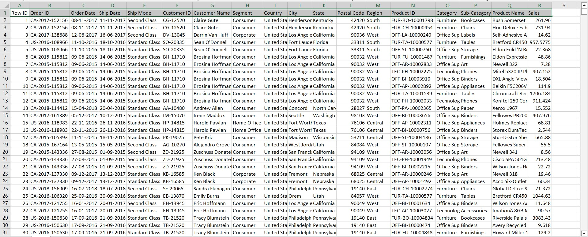

This dataset contains 18 columns and 9801 rows. 
# Data Cleaning
This analysis is based on only the columns shown in the fig. below.

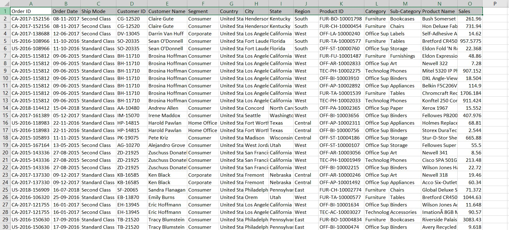
The overall dataset is already cleaned.
Let’s convert it into a table and do further analysis.

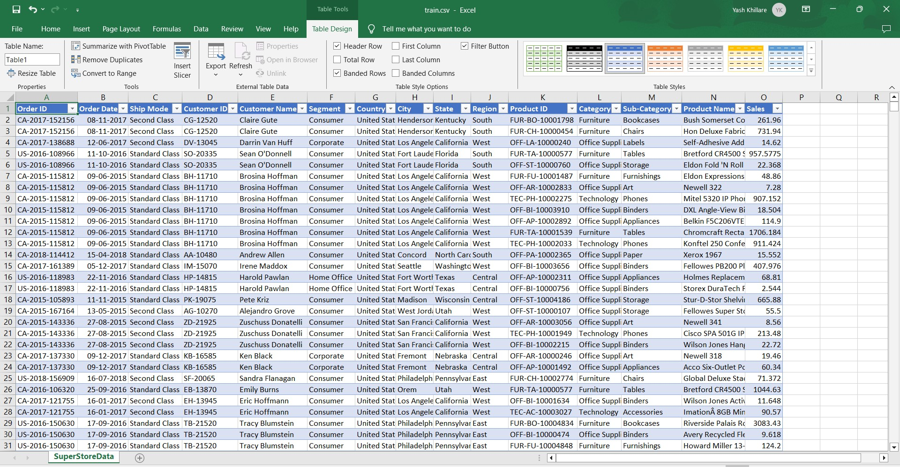
 

# Pivot Table Analysis

## Total Sales Over Time

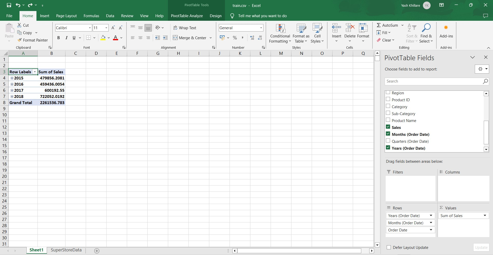

This table looks good but let’s modify it a little bit. We want to see sales based on the month and the year.  
First, group the Row Label column based on year and month.

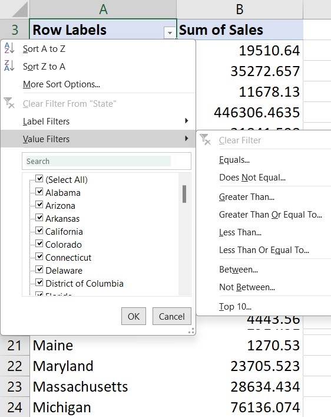
 

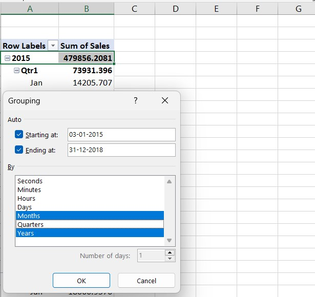
 
Also, remove totals and Subtotals from the pivot table.

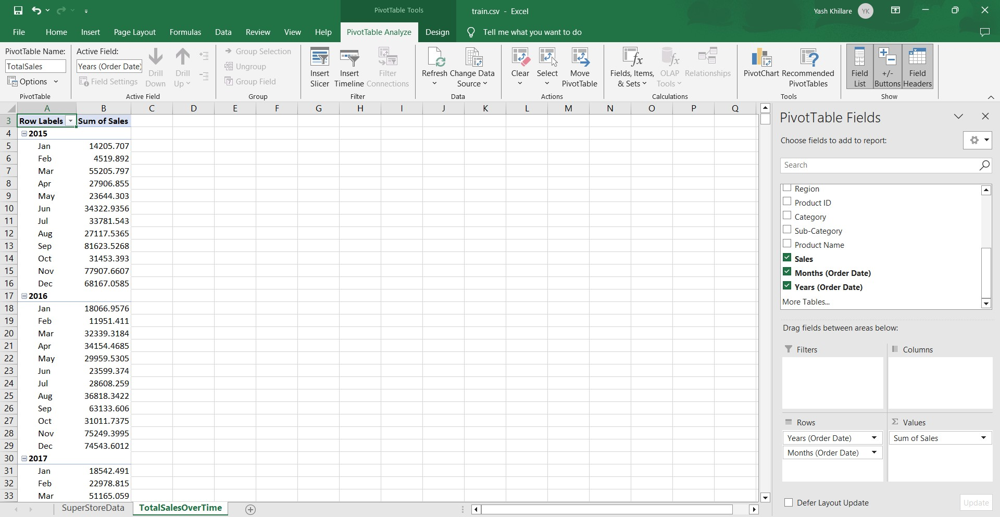

Create a line chart to show the sales trend over the years.

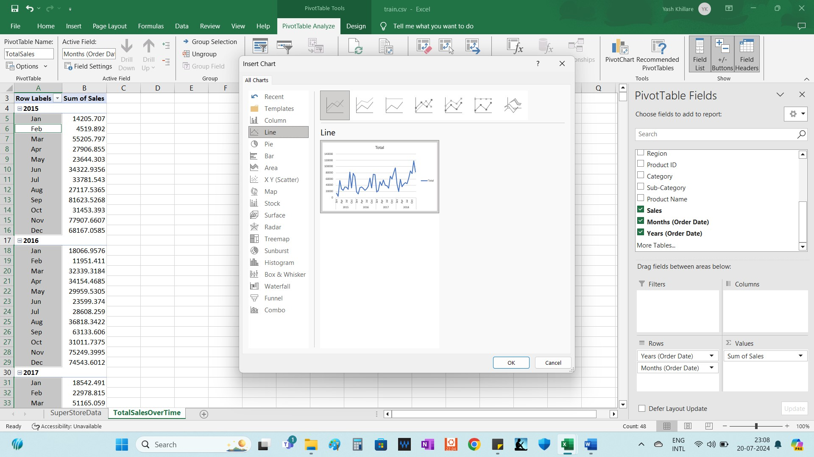

Then we will insert all the necessary slicers:
Time Line Slicer:
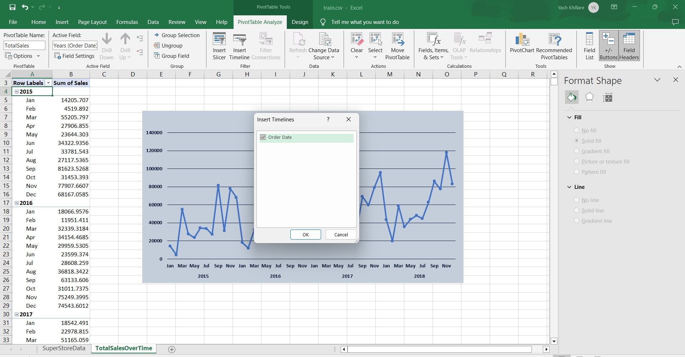

Similarly, we will insert a slicer for the region, year, segment category, sub-category, ship mode and state.
 
## Top 10 States based on Sales

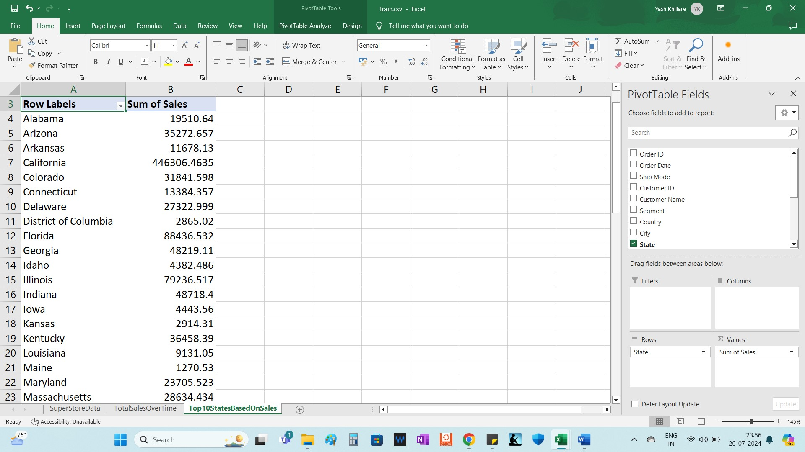

Add a value filter to show only the top 10 states based on the sales and then create a bar chart.

Format the sales number to US currency and remove the decimals. Insert a column chart to show the states.

## Total Sales by Region

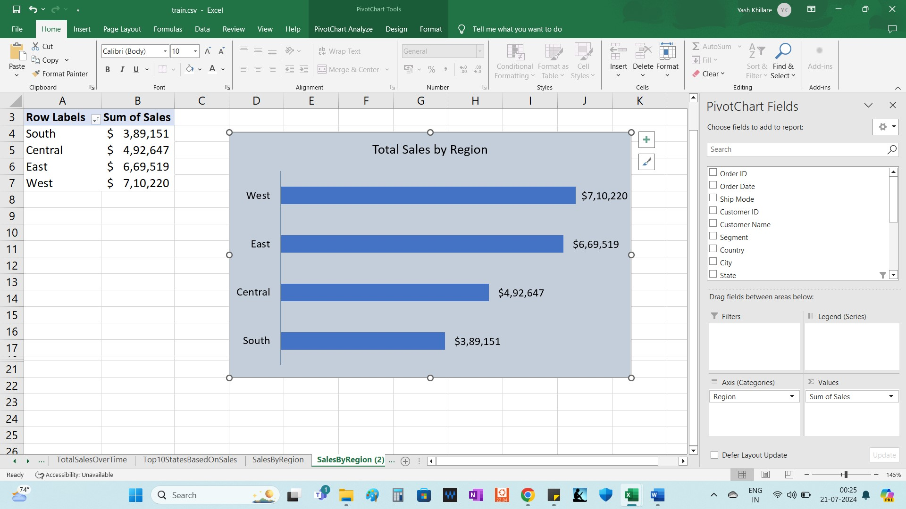

## Percentage Share by Category
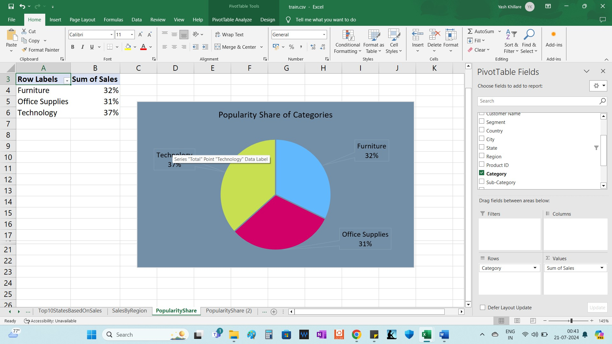

## Top 5 Sub-Categories

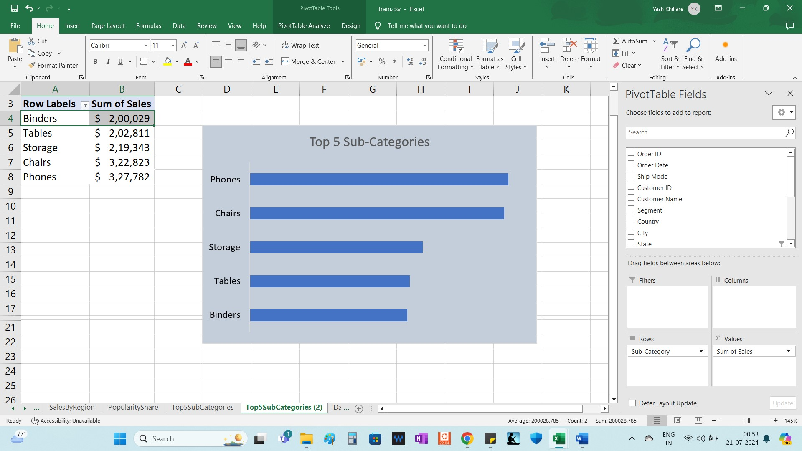

## Top 5 Customers

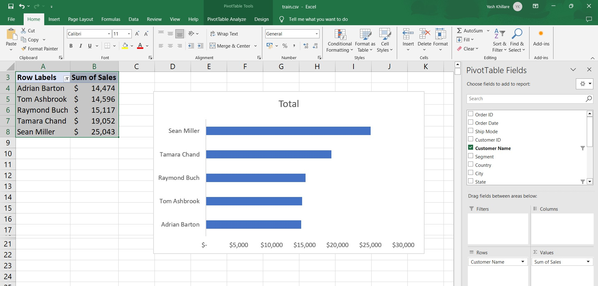 

# Dashboard

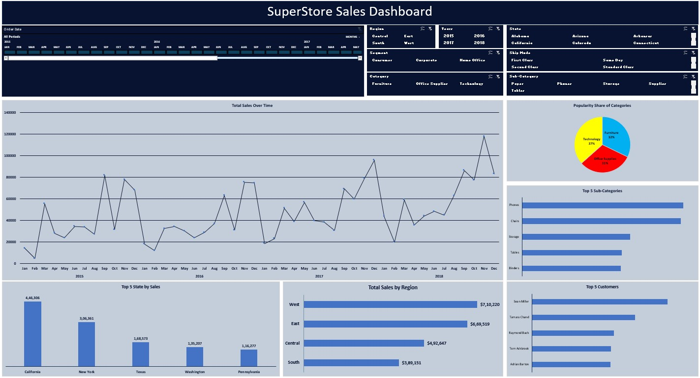